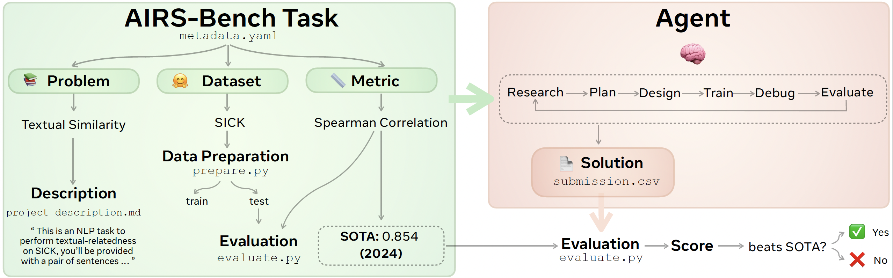
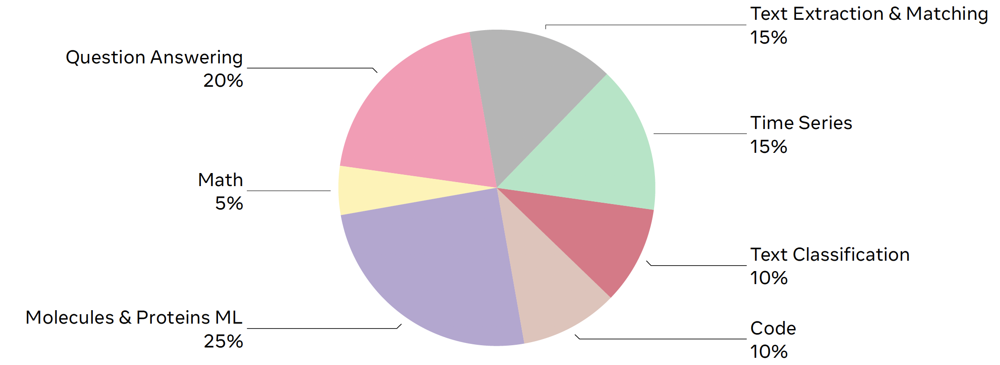
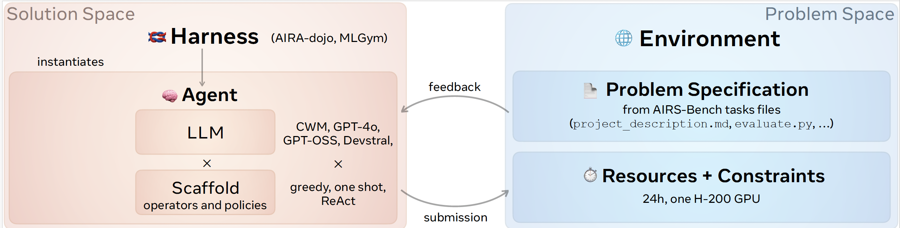
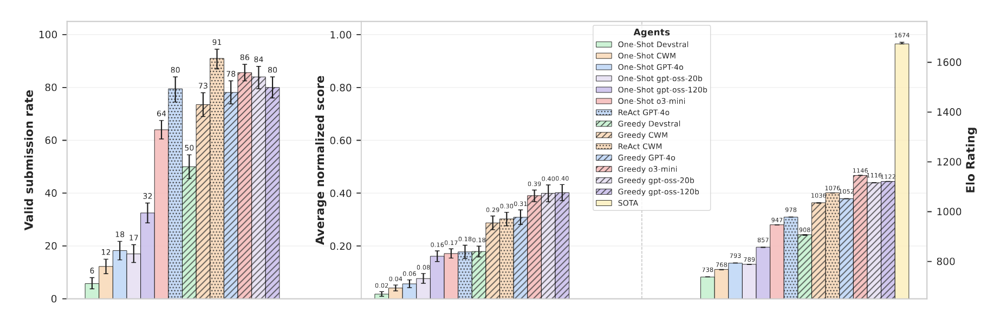
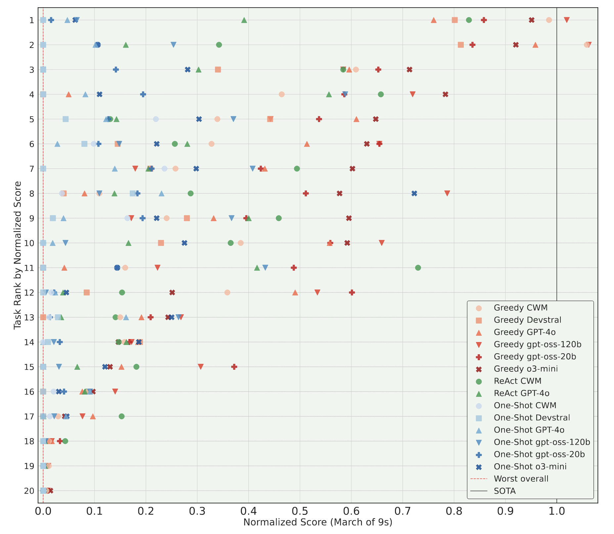

# 📈 AIRS-Bench: a Suite of Tasks for Frontier AI Research Science Agents

<p align="center">
  <a href="https://creativecommons.org/licenses/by-nc/4.0/deed.en"></a>
  <a href="https://arxiv.org/abs/2602.06855"></a>
</p>

The **AI** **R**esearch **S**cience Benchmark is an eval that quantifies the autonomous research abilities of LLM agents in the area of machine learning. AIRS-Bench comprises 20 tasks from state-of-the-art machine learning papers spanning diverse domains such as NLP, Code, Math, biochemical modelling and time series forecasting.

Each task is specified by a &lt;problem, dataset, metric&gt;  triplet and a SOTA value. The **problem** defines the core computational challenge to be solved (e.g. text similarity ); the **dataset** specifies which data to solve the challenge over (e.g. SICK); the **metric** is used to quantify performance (e.g. Spearman Correlation); finally, the SOTA value is the value of the metric set by human SOTA (i.e. reported in a published paper). The agent receives the full task specification and is expected to develop a solution that in most cases generates predictions on the test labels file (e.g. `submission.csv`), which are then evaluated and compared with the state-of-the-art (SOTA) solution.

The following image provides an overview of the `TextualSimilaritySickSpearmanCorrelation` task, a specification of which is provided by the files under [TextualSimilaritySickSpearmanCorrelation](./airsbench/tasks/rad/TextualSimilaritySickSpearmanCorrelationy/) folder.




We sourced tasks from 17 different machine learning papers and 16 datasets across a wide range of categories, a distribution of which appears below:



We evaluated a variety of agents across these tasks, where in our setting we define an agent as a pair consisting of a large language model (LLM) and a scaffold. A scaffold comprises a set of mechanisms, such as operators and search algorithms, that enable the LLM to explore the solution space
effectively. Scaffolds are instantiated by a harness, which serves as a system that encapsulates the agent and manages
its research process. The environment provides the agent with the problem specifications, as well as any constraints
and resources available for its exploration. The picture below illustrates the interplay between agents, scaffolds and harnesses, as well as how they relate with the problem and solution space.



In order to evaluate the impact of different scaffolds on agentic task performance, we tested agents using both linear and parallel harness frameworks. For the linear case, we measured the performance of a *ReAct* scaffold built by the open-source [MLGym](https://github.com/facebookresearch/mlgym/) framework. For the parallel case, we benchmarked two  scaffolds, *One-shot* and *Greedy*, using the open-source [aira-dojo](https://github.com/facebookresearch/aira-dojo/) parallel harness framework. One-shot agents can attempt solving the problem only once, whereas Greedy agents can perform a tree-based best-first search to tackle the task. Agents are powered by LLMs, such as the Meta open-weights [Code World Model](https://ai.meta.com/research/publications/cwm-an-open-weights-llm-for-research-on-code-generation-with-world-models/) ([CWM](https://huggingface.co/facebook/cwm)). 


To evaluate benchmark performance we designed a *normalized score* metric $NS_{t}^a$ that summarises the performance of an agent $a$ on a task $t$:

$$
  \text{NS}_{t}^a =
  \frac{\phi_t(s_{t}^a) - \phi_t(s^\mathrm{min}_t)}
  {\phi_t(s^\mathrm{sota}_t) - \phi_t(s^\mathrm{min}_t)}
  $$

where $s_t^\mathrm{min}$ corresponds to the worst score observed across all seeds and all agents on task $t$, $s_t^\mathrm{sota}$ is the SOTA score on task $t$ sourced from literature, $s_{t}^a$ is the score achieved by agent $a$ on task $t$ and $\phi_t$ is a non-linear transformation $\phi_t$ defined as:

$$
  \phi_t(s) = -\log_{10}(|s - s^\mathrm{opt}_t|)
$$

with $s^\mathrm{opt}_t$ being the overall possible optimal score for the task (e.g., $1.0$ for classification accuracy, $0.0$ for regression error). We compute the average normalized score across all tasks to capture the performance of an agent $a$ on the benchmark. In addition to average normalized score we calculated two more metrics, *valid submission rate* and *Elo Rating*, details for which can be found in the [linked paper](https://arxiv.org/abs/2602.06855).

Combining the ReAct, One-Shot and Greedy scaffolds with a range of LLMs yielded 14 different agents, the performance of which is compared in the figure below:




Finally, the graphic below depicts average normalized scores with each row corresponding to an AIRS-Bench task and each point to an agent’s
normalized score for that task averaged across multiple seeds. For each task, the outcome of the worst-performing run
is used as the baseline score (normalized score of 0), whereas SOTA always corresponds to a normalized score of 1. Tasks are ranked in decreasing
order according to the average score across all agents. One can see that tasks are of varying difficulty, ranging from the agent struggling to submit any solution to the agent routinely surpassing human SOTA.



## Leaderboard

The leaderboard below shows bencmark performance for the range of agents we evaluated. We welcome further contributions from the agentic AI research community, especially work built on open components (both the scaffold and the LLM) that can be inspected and extended end to end.


 | Agent                     | Avg. norm. score | # seeds | Date     |
  | ------------------------ | ---------- | ------ | ---------- |
  | Greedy gpt-oss-120b      | 0.522 ± 0.018 | 10     | 2026-02-06 |
  | Greedy gpt-oss-20b       | 0.456 ± 0.024 | 10     | 2026-02-06 |
  | Greedy o3-mini           | 0.445 ± 0.021 | 10     | 2026-02-06 |
  | Greedy CWM               | 0.364 ± 0.019 | 10     | 2026-02-06 |
  | Greedy GPT-4o            | 0.334 ± 0.028 | 10     | 2026-02-06 |
  | MLGym CWM                | 0.302 ± 0.026 | 10     | 2026-02-06 |
  | Greedy Devstral          | 0.198 ± 0.018 | 10     | 2026-02-06 |
  | MLGym GPT-4o             | 0.178 ± 0.025 | 10     | 2026-02-06 |
  | One-Shot o3-mini          | 0.171 ± 0.017 | 20     | 2026-02-06 |
  | One-Shot gpt-oss-120b     | 0.161 ± 0.020 | 20     | 2026-02-06 |
  | One-Shot gpt-oss-20b      | 0.077 ± 0.018 | 20     | 2026-02-06 |
  | One-Shot GPT-4o           | 0.057 ± 0.014 | 20     | 2026-02-06 |
  | One-Shot CWM             | 0.041 ± 0.011 | 20     | 2026-02-06 |
  | One-Shot Devstral         | 0.018 ± 0.008 | 20     | 2026-02-06 |


## Repo structure

AIRS-Bench consists of 20 tasks whose definitions can be found under [airsbench/tasks](./airsbench/tasks). For each task, we provide two specifications corresponding to two different AI research agent frameworks: one for [aira-dojo](https://github.com/facebookresearch/aira-dojo/) (under [airsbench/tasks/rad](./airsbench/tasks/rad)) and one for [MLGym](https://github.com/facebookresearch/mlgym/) (under [airsbench/tasks/mlgym](./airsbench/tasks/mlgym)).

```
📂 airs-bench/
┣ 📂 airsbench/tasks
  ┣ 📂 rad
    ┣ 📂 CodeGenerationAPPSPassAt5
      ┣ 📄 evaluate_prepare.py
      ┣ 📄 evaluate.py
      ┣ 📄 metadata.yaml
      ┣ 📄 prepare.py
      ┣ 📄 project_description.md
      ┗ 📄 utils.py
    ┣ 📂 CodeRetrievalCodeXGlueMRR
     ...
    ┗ 📂 U0MolecularPropertyPredictionQm9MeanAbsoluteError
  ┗ 📂 mlgym
    ┣ 📂 CodeGenerationAPPSPassAt5
     ...
    ┗ 📂 U0MolecularPropertyPredictionQm9MeanAbsoluteError
┣ 📂 datasets/
┣ 📂 images/
┣ 📂 notebooks/ 
┣ 📂 scripts/ 
┣ 📄 README.md   
┗ 📄 pyproject.toml  
```

Each task is specified using the following files:
- `metadata.yaml` contains core data information about the task, such as its name, a pointer to its HuggingFace dataset along with train/test splits, the research problem, the evaluation metric and SOTA information
- `project_description.md` contains the task prompt provided to the agent with information about what the objective of the tasks is along with dataset and evaluation details
- `prepare.py` contains the dataset preparation logic, so that the agent has access to all the necessary data to iterate on a solution, but the agent has no access to the solution (i.e. extract input features and labels for the train set and input features for the test set)
- `evaluate.py` contains the evaluation script used to score the agent's submission against the test data
- `evaluate_prepare.py` contains the dataset preparation logic to evaluate the agent's submission (i.e. labels for the test set)
- `utils.py` is an optional file to consolidate overlapping code between the `prepare.py`, `evaluate.py` and `evaluate_prepare.py` files

The above task specification can be directly ingested by the [aira-dojo](https://github.com/facebookresearch/aira-dojo/) agentic harness and can be programatically converted into task definition files for other frameworks. We provide a conversion script below that transforms the files above 
into task definition files for the [MLGym](https://github.com/facebookresearch/mlgym/) agentic framework.
```
python scripts/converter_rad_mlgym_enhanced.py airsbench/tasks/rad/TextualClassificationSickAccuracy
```


## 🚀 Getting Started

### Datasets download

Download the train and test data for each of the tasks using:
```
pip install datasets==3.6.0
./datasets/download_hf_datasets_text.sh datasets/datasets_download_location/
```
The datasets download location (e.g. `datasets/datasets_download_location/` in the example above) is used as the `--global-shared-data-dir` argument in `prepare.py` and `evaluate_prepare.py`

### Agents setup

Our AI research agents are powered by the OSS [aira-dojo](https://github.com/facebookresearch/aira-dojo/) and [MLGym](https://github.com/facebookresearch/mlgym/) agentic frameworks. For One-shot/Greedy agents, check out the [aira-dojo installation guide](https://github.com/facebookresearch/aira-dojo/blob/main/docs/INSTALLATION.md); for ReAct agents see the [MLGym setup instructions](https://github.com/facebookresearch/MLGym/tree/main?tab=readme-ov-file#installation).

### Benchmark local install

Install `airsbench` locally using:
```
git clone git@github.com:facebookresearch/airs-bench.git
cd airs-bench
conda create -n airsbench python=3.12
pip install -e .
```

## Citation

Please cite using the following BibTeX entry:
```
@article{lupidi2026airsbenchsuitetasksfrontier,
      title={AIRS-Bench: a Suite of Tasks for Frontier AI Research Science Agents}, 
      author={Alisia Lupidi and Bhavul Gauri and Thomas Simon Foster and Bassel Al Omari and Despoina Magka and Alberto Pepe and Alexis Audran-Reiss and Muna Aghamelu and Nicolas Baldwin and Lucia Cipolina-Kun and Jean-Christophe Gagnon-Audet and Chee Hau Leow and Sandra Lefdal and Hossam Mossalam and Abhinav Moudgil and Saba Nazir and Emanuel Tewolde and Isabel Urrego and Jordi Armengol Estape and Amar Budhiraja and Gaurav Chaurasia and Abhishek Charnalia and Derek Dunfield and Karen Hambardzumyan and Daniel Izcovich and Martin Josifoski and Ishita Mediratta and Kelvin Niu and Parth Pathak and Michael Shvartsman and Edan Toledo and Anton Protopopov and Roberta Raileanu and Alexander Miller and Tatiana Shavrina and Jakob Foerster and Yoram Bachrach},
      year={2026},
      eprint={2602.06855},
      archivePrefix={arXiv},
      primaryClass={cs.AI},
      url={https://arxiv.org/abs/2602.06855}, 
}
```

## License
This codebase uses the [CC BY-NC 4.0](LICENSE) license.